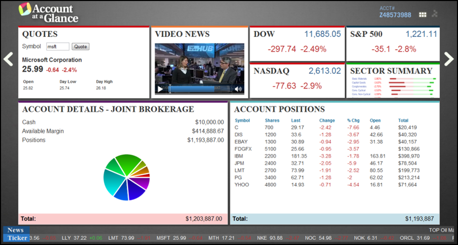
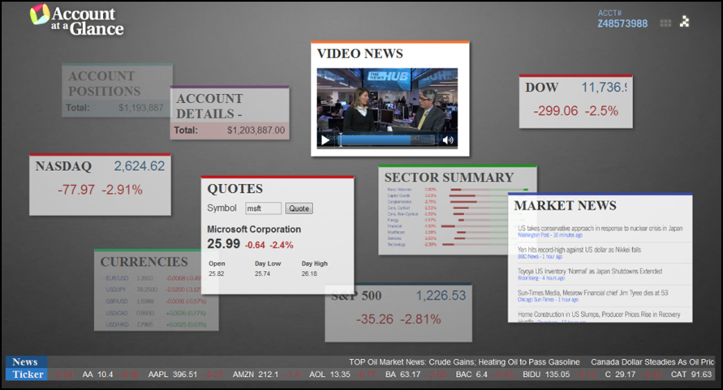

Account At a Glance Application
===============

This application provides an end-to-end look at how multiple technologies can be integrated including:

* ASP.NET MVC
* Web API
* Entity Framework and Model Objects
* The Data Repository Pattern
* Dependency Injection using the Unity IoC container
* LINQ to XML (to parse remote XML financial feeds)
* jQuery
* jQuery UI Drag and Drop
* Handlerbars HTML templates
* Modernizr
* HTML5 (Canvas and SVG for charting)
* More...

An example of the application is shown next:

## Requirements

Visual Studio 2013

## Getting Started:

Open the AccountAtAGlance.sln file in Visual Studio 2013 or higher.
